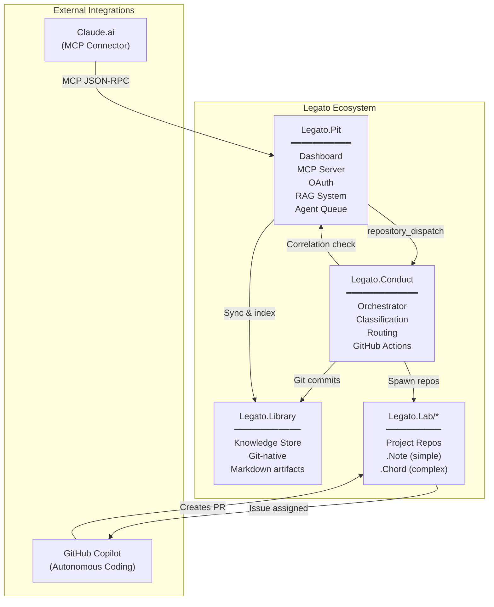
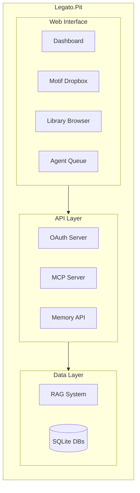
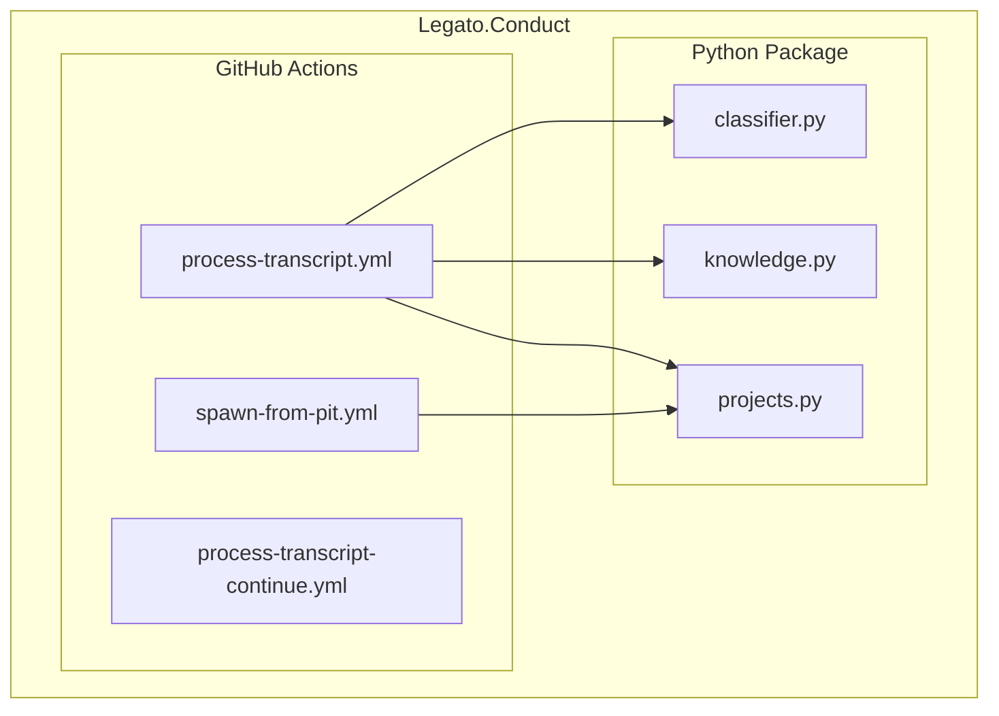
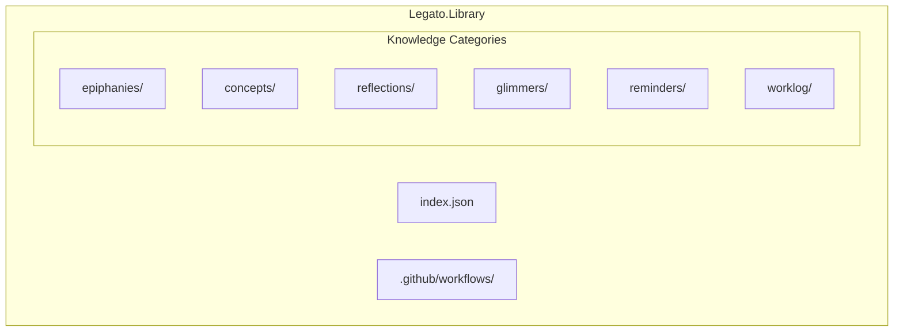
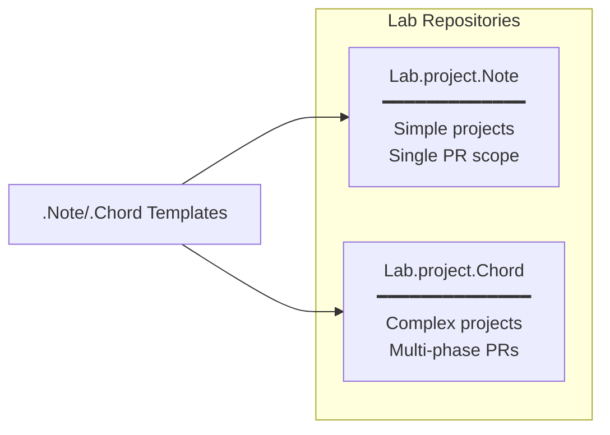
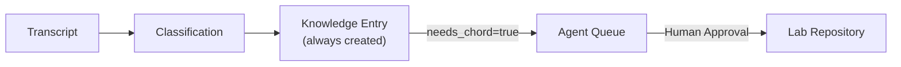
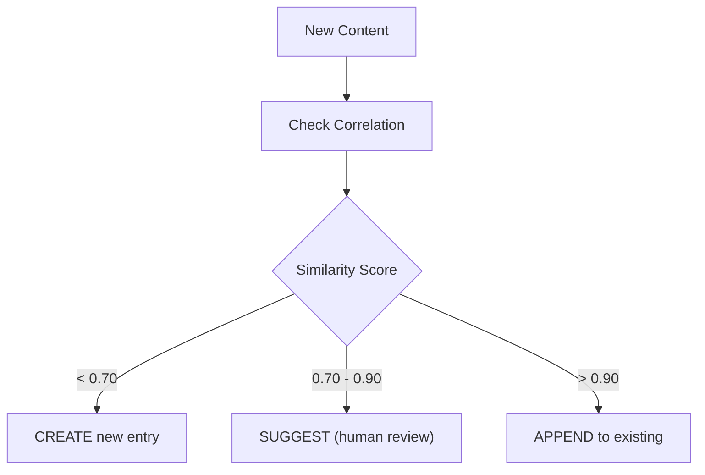
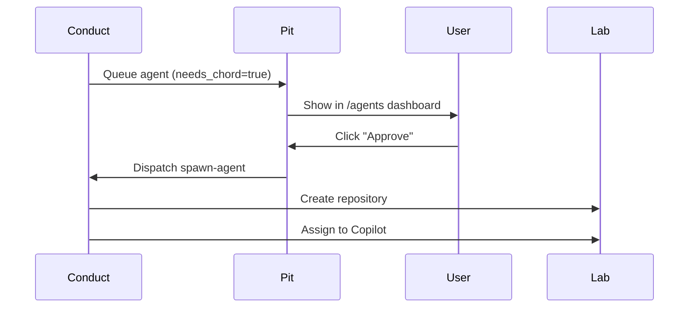
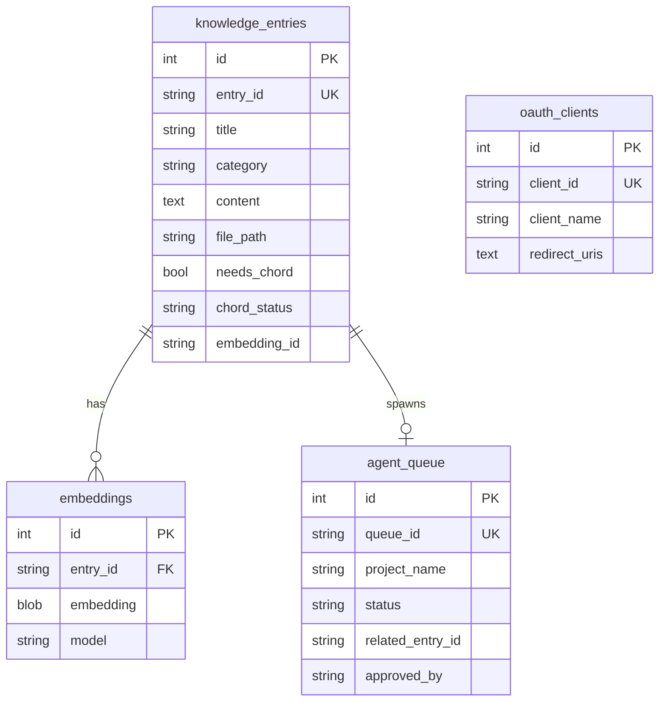
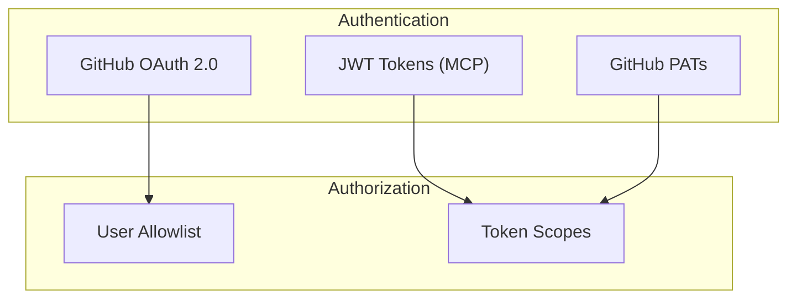

# Legato Architecture

## System Overview

Legato is an end-to-end system that transforms voice transcripts into structured knowledge artifacts and executable projects. The ecosystem consists of three core repositories orchestrated through GitHub Actions.



## Component Details

### Legato.Pit - Web Dashboard & MCP Server

The central hub for user interaction and system orchestration.



**Key Modules:**

| Module | Purpose |
|--------|---------|
| `core.py` | Flask app factory, blueprint registration |
| `auth.py` | GitHub OAuth authentication |
| `dashboard.py` | System status and monitoring |
| `dropbox.py` | Transcript intake (Motif) |
| `library.py` | Knowledge browser and search |
| `mcp_server.py` | Claude.ai MCP protocol handler |
| `oauth_server.py` | OAuth 2.1 with Dynamic Client Registration |
| `agents.py` | Project queue and approval workflow |
| `memory_api.py` | Semantic correlation API |
| `rag/*` | Embeddings, search, GitHub sync |

### Legato.Conduct - Orchestrator

Stateless orchestrator running as GitHub Actions workflows.



**Key Modules:**

| Module | Purpose |
|--------|---------|
| `classifier.py` | Parse transcripts, classify threads, check correlation |
| `knowledge.py` | Extract and commit knowledge artifacts |
| `projects.py` | Spawn Lab repositories, create issues |

### Legato.Library - Knowledge Repository

Git-native storage for all knowledge artifacts.



**Artifact Structure:**

```yaml
---
id: library.{category}.{slug}
title: "Artifact Title"
category: epiphany|concept|reflection|glimmer|reminder|worklog
created: 2026-01-07T15:30:00Z
source_transcript: transcript-2026-01-07
domain_tags: [ai, architecture]
key_phrases: ["key term", "another term"]
needs_chord: false
chord_status: null
---

# Content in markdown...
```

### Legato.Lab/* - Project Repositories

Spawned repositories for implementation projects.



**Repository Structure:**

```
Lab.project.Note/
├── .github/workflows/
│   └── on-issue-assigned.yml
├── README.md
├── SIGNAL.md              # Project intent
├── copilot-instructions.md
├── plans/
└── src/
```

## Design Decisions

### Everything Starts as Knowledge

All threads are classified as `KNOWLEDGE` first. Projects are escalated via the `needs_chord` flag.



**Rationale:** Ensures all insights are captured in the Library before any implementation begins.

### Git-Native Architecture

- No database for core artifacts (only GitHub)
- Full version history via git
- Changes visible through pull requests
- Easy to fork, replicate, audit

### Correlation Before Action

Semantic similarity is checked before creating new entries:



### Human-in-the-Loop for Projects

Projects require explicit human approval before spawning:



## Database Schema

### Pit Databases



## Security Model



**Key Security Features:**

- GitHub OAuth with PKCE for web authentication
- JWT tokens for MCP (never exposes GitHub tokens to Claude)
- User allowlist (`GH_ALLOWED_USERS`)
- Separate PATs for different operations (Library, Lab, Conduct)
