# Legato Data Flows

## End-to-End Pipeline


## Flow 1: Transcript Intake

User uploads a transcript through the Motif dropbox.


**Dispatch Payload:**
```json
{
  "event_type": "transcript-received",
  "client_payload": {
    "transcript": "Raw transcript text...",
    "source": "dropbox-2026-01-10",
    "category_definitions": [
      {"name": "epiphany", "display_name": "Epiphany", ...}
    ]
  }
}
```

## Flow 2: Classification Pipeline

Conduct processes the transcript through parsing, classification, and routing.


**Classification Output:**
```json
{
  "id": "thread-001",
  "type": "KNOWLEDGE",
  "knowledge_category": "concept",
  "knowledge_title": "MCP Protocol Overview",
  "needs_chord": false,
  "domain_tags": ["mcp", "ai", "protocol"],
  "correlation_score": 0.25,
  "correlation_action": "CREATE"
}
```

## Flow 3: Correlation Check

Conduct checks semantic similarity against existing Library entries.


**Correlation Request:**
```json
{
  "title": "MCP Protocol Overview",
  "content": "Full content text...",
  "key_phrases": ["mcp server", "json-rpc"],
  "needs_chord": false
}
```

**Correlation Response:**
```json
{
  "action": "CREATE",
  "score": 0.25,
  "matches": [
    {
      "entry_id": "kb-abc123",
      "title": "Similar Entry",
      "similarity": 0.45
    }
  ],
  "recommendation": {
    "type": "CREATE_NEW",
    "reason": "No similar entries found"
  }
}
```

## Flow 4: Knowledge Commit

Classified threads become artifacts in the Library.


**Artifact Format:**
```markdown
---
id: library.concept.mcp-protocol
title: "MCP Protocol Overview"
category: concept
created: 2026-01-10T14:30:00Z
source_transcript: dropbox-2026-01-10
domain_tags: [mcp, ai, protocol]
key_phrases: [mcp server, json-rpc]
needs_chord: false
---

# MCP Protocol Overview

Content extracted from transcript...
```

## Flow 5: Agent Queue & Approval

Threads with `needs_chord=true` go through human approval.

```mermaid
sequenceDiagram
    participant C as Conduct
    participant P as Pit
    participant U as User
    participant A as Agent Queue

    C->>P: POST /agents/api/from-entry
    Note right of C: entry_id, project_name, type
    P->>A: Insert queue record
    A-->>P: queue_id
    P-->>C: Queued response

    U->>P: GET /agents (dashboard)
    P->>A: Fetch pending agents
    A-->>P: List of pending
    P-->>U: Render queue UI

    U->>P: POST /agents/api/{id}/approve
    P->>A: Update status → approved
    P->>C: Dispatch spawn-agent
```



**Queue Entry:**
```json
{
  "queue_id": "aq-abc123",
  "project_name": "mcp-bedrock-adapter",
  "project_type": "note",
  "title": "MCP Bedrock Adapter",
  "description": "Wraps AWS Bedrock...",
  "related_entry_id": "kb-xyz789",
  "status": "pending"
}
```

## Flow 6: Project Spawning

Approved projects become Lab repositories.


**SIGNAL.md:**
```markdown
# MCP Bedrock Adapter

## Intent
MCP server that wraps AWS Bedrock API for JWICS environments.

## Domain Tags
mcp, aws, bedrock, classified

## Source
- Transcript: dropbox-2026-01-10
- Library Entry: kb-xyz789

## Related
- [MCP Protocol Overview](../../Legato.Library/concepts/...)
```

## Flow 7: Library Sync (Background)

Pit continuously syncs with Library for RAG and correlation.


## Flow 8: MCP Integration (Claude.ai)

Claude.ai connects via MCP to search and create knowledge.


**MCP Tool Call:**
```json
{
  "jsonrpc": "2.0",
  "id": 1,
  "method": "tools/call",
  "params": {
    "name": "search_library",
    "arguments": {
      "query": "MCP protocol implementation",
      "limit": 10
    }
  }
}
```

## Flow 9: Chord Grouping

Related chord candidates are grouped into multi-note chords.


## Flow 10: Append to Existing

When correlation finds a near-duplicate, content is appended.


**Appended Format:**
```markdown
---
# ... existing frontmatter ...
updated: 2026-01-11T10:00:00Z
---

# Original Title

Original content...

---

## Update: 2026-01-11

Additional insights from new transcript...
```
