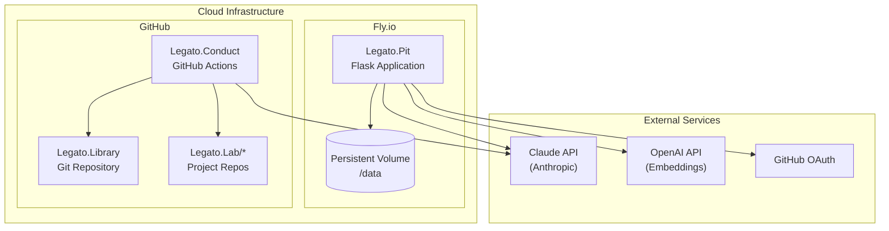

# Legato Deployment Guide

## Architecture Overview



## Pit Deployment (Fly.io)

### Prerequisites

1. [Fly.io account](https://fly.io)
2. [Fly CLI installed](https://fly.io/docs/flyctl/install/)
3. GitHub OAuth App created

### Configuration

**fly.toml:**
```toml
app = "legato-pit"
primary_region = "iad"

[build]
  builder = "paketobuildpacks/builder:base"

[env]
  FLASK_ENV = "production"
  PORT = "8080"

[http_service]
  internal_port = 8080
  force_https = true
  auto_stop_machines = true
  auto_start_machines = true
  min_machines_running = 0

[mounts]
  source = "legato_data"
  destination = "/data"
```

### Environment Variables

Set these secrets in Fly.io:

```bash
# GitHub OAuth
fly secrets set GH_OAUTH_CLIENT_ID="your-client-id"
fly secrets set GH_OAUTH_CLIENT_SECRET="your-client-secret"
fly secrets set GH_ALLOWED_USERS="username1,username2"

# API Keys
fly secrets set ANTHROPIC_API_KEY="sk-ant-..."
fly secrets set OPENAI_API_KEY="sk-..."
fly secrets set SYSTEM_PAT="ghp_..."

# Flask
fly secrets set FLASK_SECRET_KEY="$(openssl rand -hex 32)"

# Optional
fly secrets set JWT_SECRET_KEY="$(openssl rand -hex 32)"
```

### Deployment Steps

```bash
# Login to Fly
fly auth login

# Create app (first time)
fly apps create legato-pit

# Create persistent volume
fly volumes create legato_data --size 1 --region iad

# Deploy
fly deploy

# Check status
fly status
fly logs
```

### GitHub OAuth App Setup

1. Go to GitHub → Settings → Developer settings → OAuth Apps
2. Create new OAuth App:
   - **Application name:** Legato Pit
   - **Homepage URL:** `https://legato-pit.fly.dev`
   - **Authorization callback URL:** `https://legato-pit.fly.dev/auth/github/callback`
3. Copy Client ID and Client Secret to Fly secrets

---

## Conduct Deployment (GitHub Actions)

Conduct runs entirely on GitHub Actions - no separate deployment needed.

### Repository Secrets

Set these in Legato.Conduct → Settings → Secrets and variables → Actions:

| Secret | Purpose |
|--------|---------|
| `ANTHROPIC_API_KEY` | Claude API for classification |
| `LIBRARY_PAT` | Write access to Legato.Library |
| `LAB_PAT` | Create repos in Legato.Lab |
| `PIT_URL` | Pit URL (e.g., `https://legato-pit.fly.dev`) |
| `SYSTEM_PAT` | API access to Pit |

### Workflow Permissions

In Legato.Conduct → Settings → Actions → General:
- **Workflow permissions:** Read and write permissions
- **Allow GitHub Actions to create and approve pull requests:** ✓

---

## Library Setup

### Initial Structure

```bash
# Clone template or create manually
mkdir Legato.Library
cd Legato.Library

# Create category directories
mkdir epiphanies concepts reflections glimmers reminders worklog

# Create index
echo "[]" > index.json

# Initialize git
git init
git add .
git commit -m "Initial library structure"
git remote add origin git@github.com:username/Legato.Library.git
git push -u origin main
```

### Visibility

The Library can be **public** or **private**:
- **Private:** Requires `SYSTEM_PAT` with `repo` scope
- **Public:** `public_repo` scope sufficient

To change visibility:
1. Go to repo → Settings → Danger Zone
2. Click "Change repository visibility"

---

## Lab Template Repositories

Create template repositories for project spawning:

### .Note Template

Create `Legato.Lab.Note.Template`:

```
.github/
  workflows/
    on-issue-assigned.yml
README.md
SIGNAL.md.template
copilot-instructions.md
plans/
  initial.md
src/
  .gitkeep
```

Mark as template: Settings → General → Template repository ✓

### .Chord Template

Create `Legato.Lab.Chord.Template`:

```
.github/
  workflows/
    on-issue-assigned.yml
    phase-complete.yml
README.md
SIGNAL.md.template
copilot-instructions.md
init/
  bootstrap.md
plans/
  phase-01-foundation.md
  phase-02-core.md
  phase-03-integration.md
docs/
src/
tests/
```

Mark as template: Settings → General → Template repository ✓

---

## Token Scopes

### SYSTEM_PAT (Pit → GitHub)

Required scopes:
- `repo` (full repo access for private repos)
- `workflow` (trigger workflows)
- `read:user` (verify user info)

### LIBRARY_PAT (Conduct → Library)

Required scopes:
- `repo` or `public_repo` (depending on visibility)

### LAB_PAT (Conduct → Lab)

Required scopes:
- `repo` (create repos, issues)
- `admin:org` (if creating in org)
- `workflow` (for Copilot assignment)

---

## MCP Connector Setup

### In Claude.ai

1. Go to Settings → Connectors
2. Add custom connector: `https://legato-pit.fly.dev/mcp`
3. Complete GitHub OAuth flow
4. Verify connection (green status)

### Testing

```bash
# Test OAuth discovery
curl https://legato-pit.fly.dev/.well-known/oauth-authorization-server

# Test MCP protocol version
curl -I https://legato-pit.fly.dev/mcp
# Should return: MCP-Protocol-Version: 2025-06-18

# Test with token (get from OAuth flow)
curl -X POST https://legato-pit.fly.dev/mcp \
  -H "Authorization: Bearer YOUR_TOKEN" \
  -H "Content-Type: application/json" \
  -d '{"jsonrpc":"2.0","id":1,"method":"tools/list"}'
```

---

## Monitoring

### Health Checks

```bash
# Pit health
curl https://legato-pit.fly.dev/health

# RAG health
curl https://legato-pit.fly.dev/memory/api/health
```

### Logs

```bash
# Fly.io logs
fly logs -a legato-pit

# GitHub Actions logs
# View in GitHub → Legato.Conduct → Actions
```

### Metrics

Key metrics to monitor:
- Transcripts processed per day
- Knowledge entries created
- Correlation scores distribution
- Agent queue backlog
- MCP tool usage

---

## Backup & Recovery

### Database Backup

```bash
# SSH into Fly machine
fly ssh console -a legato-pit

# Backup databases
sqlite3 /data/legato.db ".backup /data/legato-backup.db"
sqlite3 /data/agents.db ".backup /data/agents-backup.db"

# Download backup
fly sftp get /data/legato-backup.db
```

### Library Backup

Library is Git-native - full history preserved:

```bash
git clone git@github.com:username/Legato.Library.git
```

---

## Troubleshooting

### Pit Not Starting

```bash
# Check logs
fly logs -a legato-pit

# SSH and check
fly ssh console -a legato-pit
ls -la /data/
python -c "import flask; print(flask.__version__)"
```

### OAuth Failing

1. Verify callback URL matches exactly
2. Check `GH_OAUTH_CLIENT_ID` and `GH_OAUTH_CLIENT_SECRET`
3. Verify user in `GH_ALLOWED_USERS`

### Correlation Not Working

1. Check `OPENAI_API_KEY` is set
2. Verify Library sync: `GET /memory/api/health`
3. Check embeddings table: SSH + `sqlite3 /data/legato.db`

### Workflows Not Triggering

1. Check repository secrets are set
2. Verify `SYSTEM_PAT` has `workflow` scope
3. Check Actions are enabled on repo

---

## Security Checklist

- [ ] All secrets set via Fly secrets (not in code)
- [ ] `FLASK_SECRET_KEY` is random 32+ bytes
- [ ] `GH_ALLOWED_USERS` limits access
- [ ] HTTPS enforced (`force_https = true`)
- [ ] PATs have minimal required scopes
- [ ] OAuth callback URL exact match
- [ ] Library visibility matches requirements
